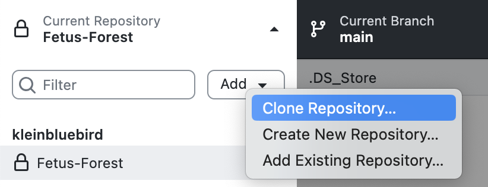
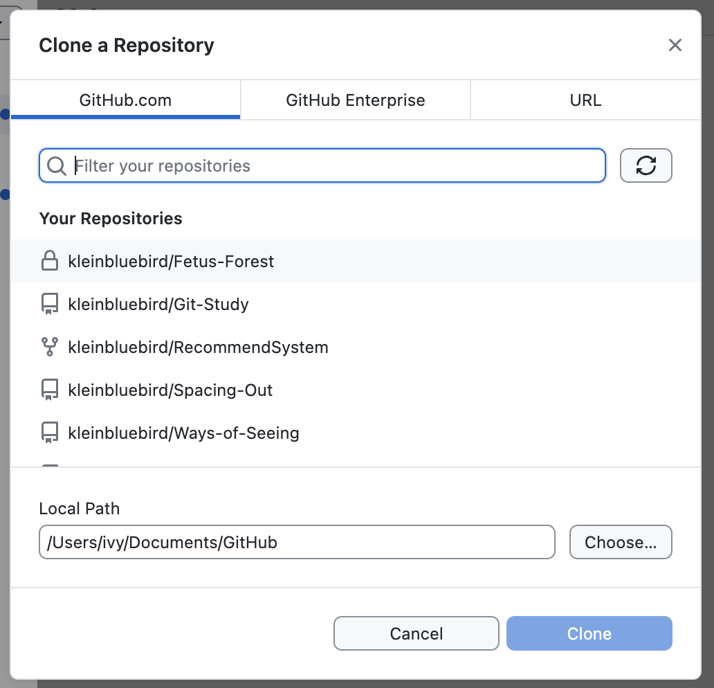
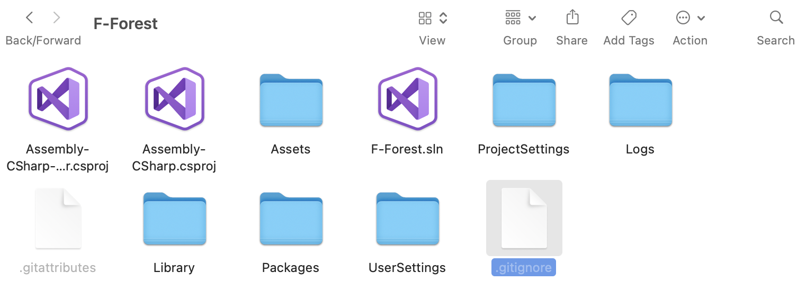
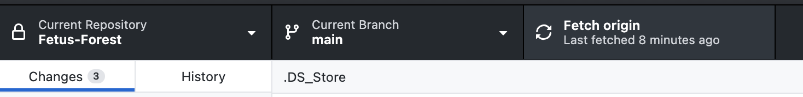
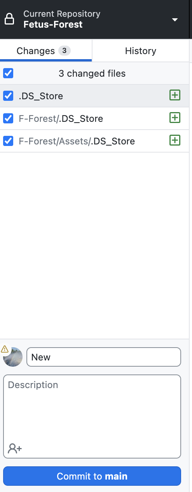
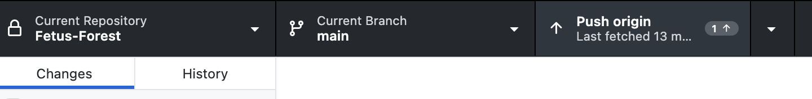
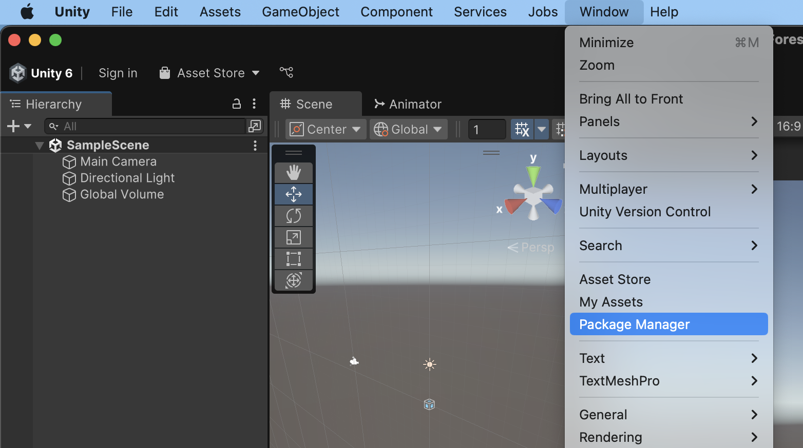
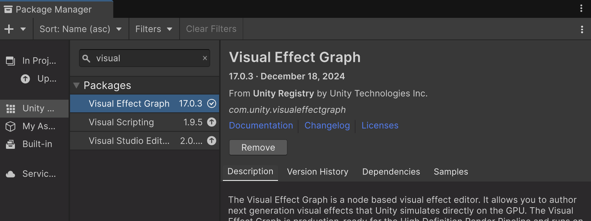
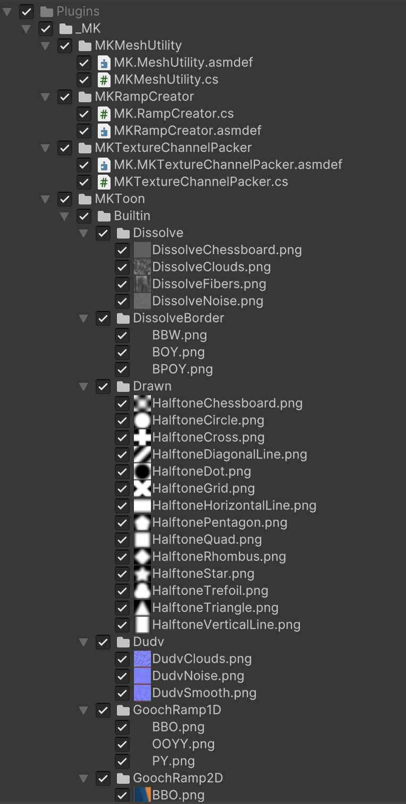
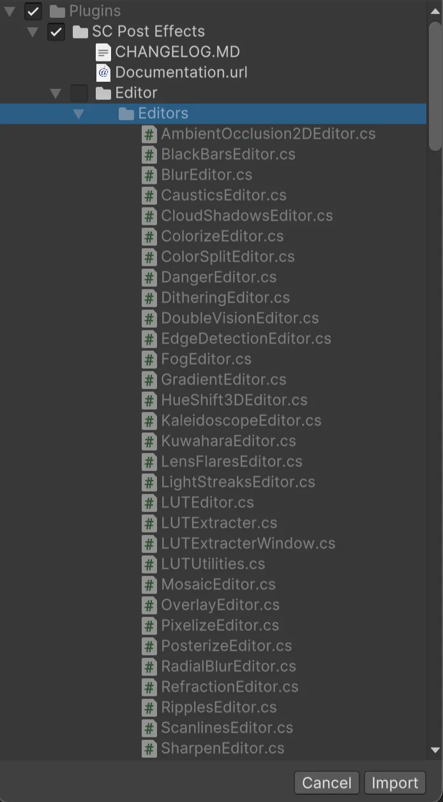

# FF项目管理手册

Question Create: March 30, 2025
Status: Done

# 项目评估

## 软件大小预估

| **内容** | **预计大小** |
| --- | --- |
| **3D 模型** | 100MB ~ 1GB |
| **贴图 & 材质** | 200MB ~ 2GB |
| **音频（20 分钟）** | 50MB ~ 500MB |
| **视频（可选）** | 500MB ~ 5GB |
| **Shader & VFX** | 50MB ~ 300MB |
| **Unity Engine & 依赖** | 500MB ~ 1GB |

**估算总大小**

- **低质量 & 高压缩**（小型 VR 体验）：**500MB ~ 1.5GB**
- **中等质量（4K 贴图 + 优化视频）**：**2GB ~ 4GB**
- **高质量（大量预渲染视频）**：**5GB ~ 10GB+**

## 资源管理策略

- **Git** 仅用于版本控制代码（C#、Shader、配置文件、Wwise数据）。
- **Google Drive** 用于存储大文件：
    - 3D 资源（FBX、Texture）
    - 影片素材（MP4、EXR）
    - 音频文件（WAV、MP3、Wwise工程）

**PRO：**

- **Git 仓库保持轻量**，不受大文件限制，代码保证版本同步。

**CON：**

- **媒体资源等大文件，需要手动管理文件版本**，无法像 Git 一样进行版本控制。

# 代码同步 - GitHub

## Unity 项目的文件存储结构

```jsx
📂 ProjectRoot/
 ├── 📂 Assets/
 │    ├── 📂 _Project/       # 自定义项目资源
 │    │    ├── 📂 Models/   # 模型、动画
 │    │    ├── 📂 Environments/ # 场景、地形、道具
 │    │    ├── 📂 UI/          # UI 资源
 │    │    ├── 📂 VFX/         # VFX 资源
 │    │    ├── 📂 Materials/   # 材质文件
 │    │    ├── 📂 Scripts/     # C# 代码
 │    │    ├── 📂 Shaders/     # Shader 代码
 │    │    ├── 📂 Audio/       # 音效文件
 │    │    ├── 📂 Video/       # 视频文件 
 │    │    ├── 📂 Textures/    # 贴图文件
 │    │    ├── 📂 Prefabs/     # 预制体
 │    ├── 📂 _SoundEngine/       # 声音工程相关资源
 │    │    ├── 📂 Wwise/   # Wwise 资源（不提交 Git）
 │    │    ├── WwiseSettings 
 │    ├── 📂 Plugins/      # 第三方插件
 │    ├── 📂 Resources/    # Unity Resources 目录
 │    │    ├── 📂 Scenes/   # 场景
 │    │    ├── 📂 Settings/   # 配置
 │    ├── 📂 StreamingAssets/ # 需要打包进游戏的外部资源
 │
 ├── 📂 Packages/    # Unity Package 依赖
 ├── 📂 ProjectSettings/ # Unity 项目设置
 ├── 📂 Builds/      # 输出的构建文件（不提交 Git）
 ├── 📂 Library/     # Unity 缓存文件（不提交 Git）
 ├── 📂 Logs/        # 日志文件（不提交 Git）
 ├── .gitignore      # Git 忽略文件
 ├── README.md       # 项目说明
 ├── unitypackage/   # 导出的 Unity 包（不提交 Git）
```

### **Google Drive内存储资源包括**

```jsx
# 3D 模型源文件（FBX, OBJ, BLEND）和大贴图
Assets/_Project/Models/**/*.fbx
Assets/_Project/Models/**/*.obj
Assets/_Project/Models/**/*.blend
Assets/_Project/Textures/**/*.tga
Assets/_Project/Textures/**/*.psd
Assets/_Project/Textures/**/*.tiff
Assets/_Project/Textures/**/*.exr

# 大音频文件
Assets/_Project/Audio/**/*.wav
Assets/_Project/Audio/**/*.mp3
Assets/_Project/Audio/**/*.ogg

# Wwise工程文件
Assets/_SoundEngine/Wwise/**

# 视频文件
Assets/_Project/VFX/**/*.mp4
Assets/_Project/VFX/**/*.avi
Assets/_Project/VFX/**/*.mov
Assets/_Project/VFX/**/*.mkv
```

- Assets目录下的以上后缀资源不会上传git
- 为了项目从GitHub Download后能正常运行，需要手动在Unity内配置相关资源
- 建议在Google Drive新建文件夹同步为Unity内Assets目录下的文件存储结构，便于手动同步

## Unity Push To GitHub

### 首次下载Repository

<p align="center">
  
</p>

<p align="center">
  
</p>


- 按照上述操作后Local Path下会新建一个用于GitHub同步的文件夹（本地Repository）
- 注意事项 ⚠️ 本地Repository需要添加`.gitignore`文件，用于控制上传到Git的数据
    
    `.gitignore` 需要：
    
    - **忽略不必要的 Unity 生成文件**（Library、Logs、Temp 等）。
    - **忽略 Mac & Windows 平台的系统文件**。
    - **保留需要共享的核心文件**（如 `Assets/`、`Packages/`、`ProjectSettings/`）。
    - **忽略上传Google Drive管理的资源。**
    
    可能Clone的时候自动下载有，但建议Double Check一下
    
    - **`.gitignore` 内容**
        
        ```jsx
        # --- Unity 相关 ---
        [Ll]ibrary/
        [Tt]emp/
        [Oo]bj/
        [Bb]uild/
        [Bb]uilds/
        [Ll]ogs/
        [Uu]serSettings/
        MemoryCaptures/
        
        # --- Visual Studio / JetBrains Rider (C# IDE) 相关 ---
        .vscode/
        *.csproj
        *.sln
        *.suo
        *.user
        *.userprefs
        *.pidb
        *.booproj
        *.svd
        *.pdb
        *.mdb
        *.opendb
        
        # --- Unity 的自动生成文件 ---
        *.pidb
        *.suo
        *.svd
        *.psess
        *.user
        *.userprefs
        *.unityproj
        *.sln
        *.log
        *.trace
        *.aps
        
        # --- 不提交 Unity 导出的包 ---
        *.unitypackage
        
        # --- 只提交 _Project 目录的必要文件 ---
        # 忽略 3D 模型源文件（FBX, OBJ, BLEND）和大贴图
        *.fbx
        *.obj
        *.blend
        *.tga
        *.psd
        *.tiff
        *.exr
        
        # 忽略大音频文件（存云盘）
        *.wav
        *.mp3
        *.ogg
        
        # Wwise工程文件（压缩后存云盘）
        Assets/_SoundEngine/Wwise/
        
        # 忽略视频文件（存云盘）
        *.mp4
        *.avi
        *.mov
        *.mkv
        
        # --- Mac 系统相关 ---
        .DS_Store
        ._*
        
        # --- Windows 系统相关 ---
        Thumbs.db
        Desktop.ini
        $RECYCLE.BIN/
        
        # --- 版本管理相关 ---
        .git/
        .gitignore
        *.gitkeep
        
        # --- 依赖管理 ---
        /Packages/com.unity.package-manager/
        
        ```
        
    - **在 Mac 上检查 `.gitignore`**
        - 快捷键`command` + `shift` + `.`
        - 看到**`.gitignore`**  文件，双击
            
            
            
        - 再次快捷键`command` + `shift` + `.` 恢复原状
    - **在 Win 上检查 `.gitignore`**
        - 看资源目录下有无**`.gitignore`**  文件，双击用text点开看

### 后续每次同步

**Download**



- 选择Current Branch为main，点击Fetch origin

**Upload**



- 勾选想要同步的Changes项，填写Summary，点击Commit to **main**（也可以改变Current Branch到分支，分支管理细节依据后续项目需求）
- 每次更新内容后建议Commit到分支先，确认无误后再合并到main
- 随后点击Push origin（跟Fetch origin在同一位置）
    
    
    
- ⚠️ **大文件（音频、图像）有更新注意同步到Google Drive**
    - **3D 资源**（FBX, OBJ, BLEND）：请存放到 Google Drive。
    - **高清贴图**（PSD, TGA, EXR）：请存放到 Google Drive，Git 只存 PNG 版本。
    - **音频文件**（WAV, MP3）：请存放到 Google Drive，Git 只存 OGG 或 AAC。
    - **视频文件**（MP4, MOV）：存 Google Drive，Git 仅存低分辨率参考版。

# Unity 插件同步

以下插件可能需要手动安装，可以在Unity-Window-Package Manager内Double Check



1. Visual Effect Graph - 支持VFX
    
    
    

---

以下插件通过unity package导入，.unitypackage文件上传至Google Drive，导入后请放到Assets/Plugins目录下

1. MK Toon Shaders
    
    
    

1. SC Post Effects Pack


